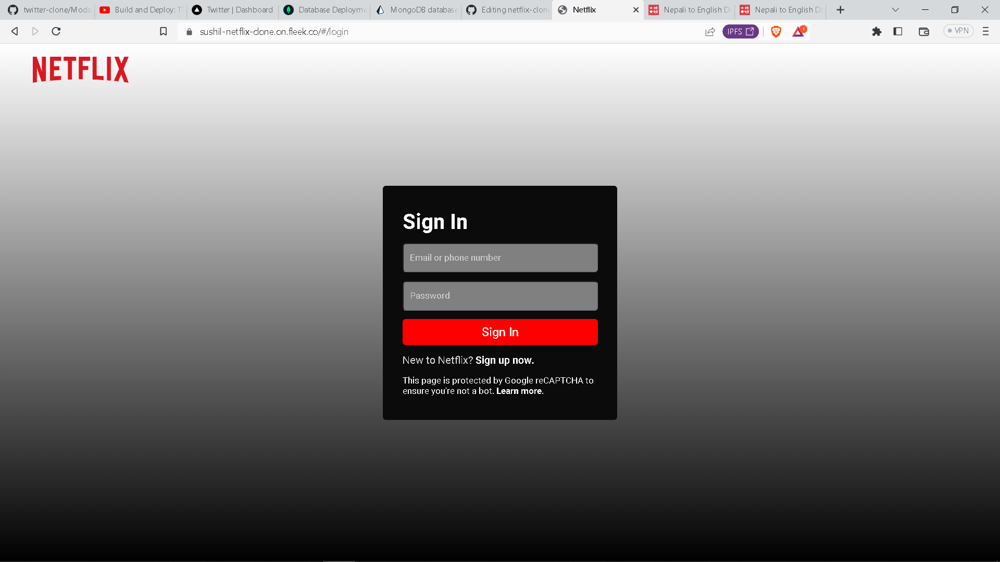
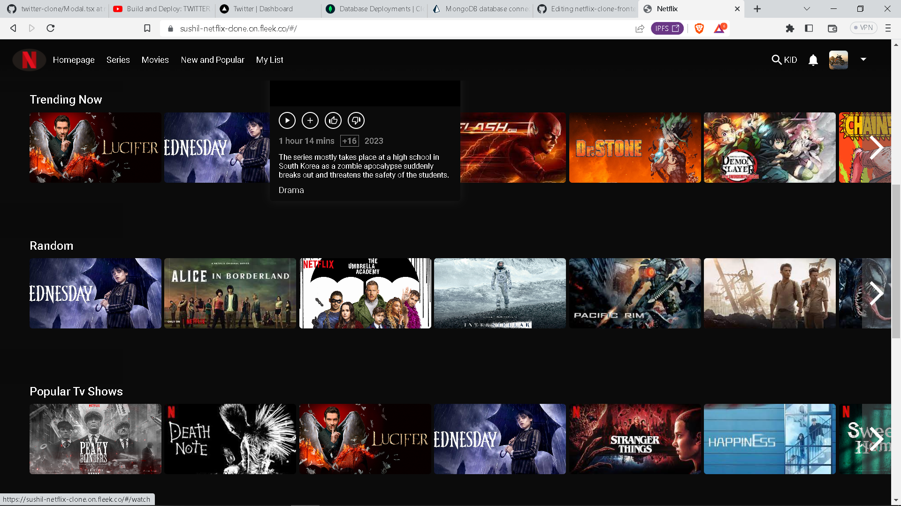
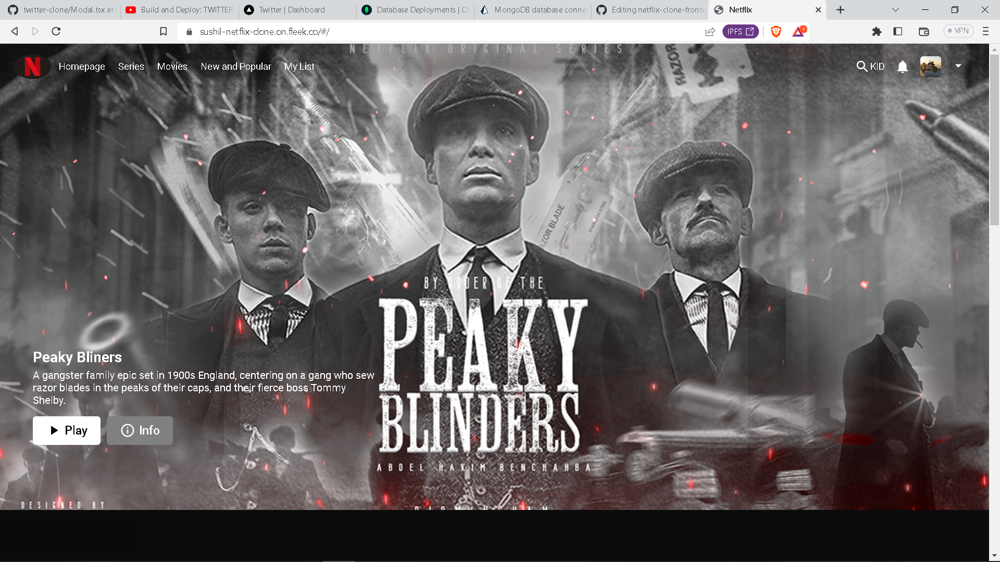
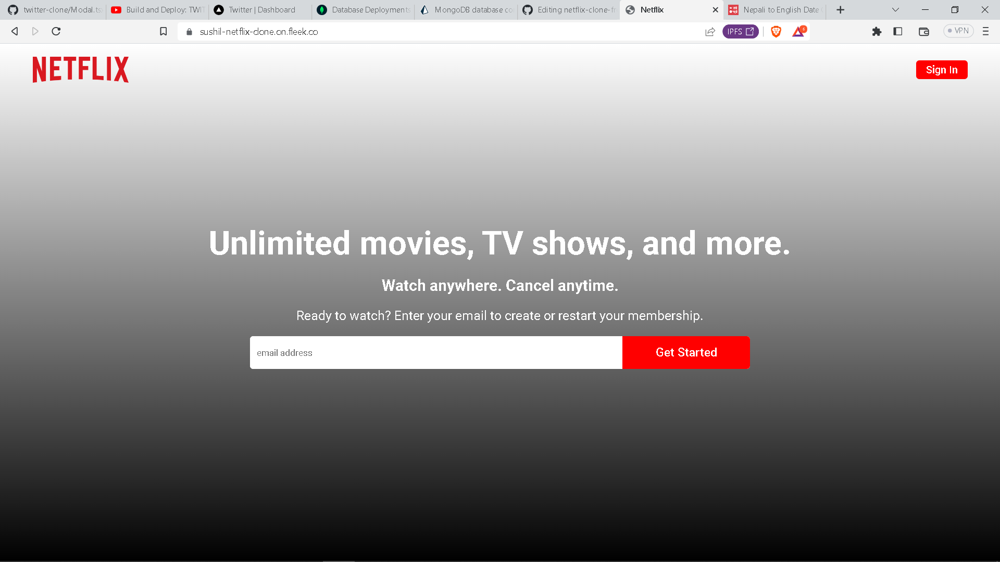

# MERN Stack Netflix Clone with MangoDB, Express.js, React, Neode.js, SASS, and Material UI.

### Feature

- Sign up and login
- Watch movies and TV series
- Filter movies and TV series with a specific genre

### upcoming feature

- update profile picture
- update user details
- forget password
- movie recommendation for user

### https://sushil-netflix-clone.on.fleek.co






### Prerequisites

**Node version 14.x**

### Cloning the repository

```shell
git clone https://github.com/AntonioErdeljac/next13-airbnb-clone.git
```

### Install packages

```shell
yarn 
```

### Setup .env file

```js
DATABASE_URL=
GOOGLE_CLIENT_ID=
GOOGLE_CLIENT_SECRET=
GITHUB_ID=
GITHUB_SECRET=
NEXTAUTH_SECRET=
```

### Start the app

```shell
yarn run start
```

## Available commands

Running commands with yarn `yarn run [command]`

| command         | description                              |
| :-------------- | :--------------------------------------- |
| `dev`           | Starts a development instance of the app |
